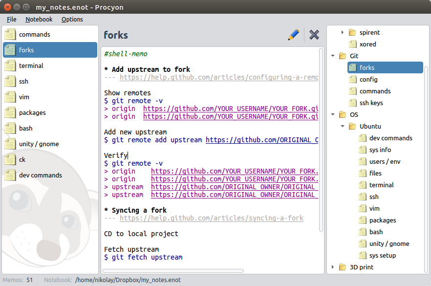

# Procyon

Procyon is personal note-keeping application. It is heavily inspired by Evernote and Microsoft OneNote and Google Keep but lacks the [fatal flow](http://www.drdobbs.com/windows/a-brief-history-of-windows-programming-r/225701475) of those :). It also lacks many of their abilities, of course, to be honest.

Procyon manages a set of text notes storing them in a single SQLite database. It doesn't use its own server, and to share the database between your machines, you are free to choose a favored sync service, e.g., Dropbox or Google Drive.

It supports syntax highlighting for some programming languages and custom highlighter for general working notes.

See [Releases](https://github.com/orion-project/procyon/releases) section for downloading binary package.



## Build

### Install hunspell

[hunspell](https://github.com/hunspell/hunspell) used for spell checking. See its official readme for full build instructions. 

```bash
curl https://codeload.github.com/hunspell/hunspell/zip/v1.7.0 > hunspell-1.7.0.zip
unzip -q hunspell-1.7.0.zip
cd hunspell-1.7.0
```

Install build tools if they are not presented:

```bash
# Linux
sudo apt install autoconf automake autopoint libtool

# macOS
brew install autoconf automake libtool gettext
```

Build commands for all platforms:

```bash
autoreconf -vfi
./configure
make
```

On macOS we have to set lower target os version than it actually is to avoid a lot of linker warnings when linking lib to application:

> object file ... was built for newer OSX version (10.12) than being linked (10.10)

https://stackoverflow.com/questions/43216273/object-file-was-built-for-newer-osx-version-than-being-linked

```bash
make CFLAGS="-g -O2 -mmacosx-version-min=10.10" LDFLAGS="-mmacosx-version-min=10.10"
```
