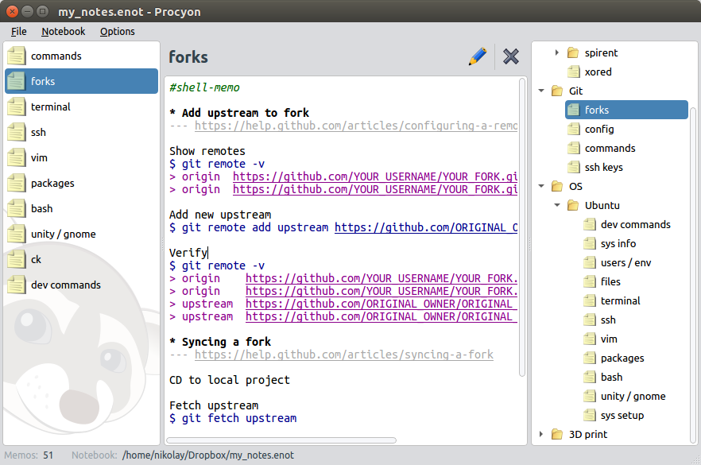

# Procyon

Procyon is a personal note-keeping application. It is heavily inspired by Evernote, and Microsoft OneNote, and Google Keep, and many others, but lacks their [fatal flaw](https://medium.com/@to.kandy/a-brief-history-of-microsoft-programming-revolutions-3185a4208ba1) :). It also lacks many of their abilities, of course, to be honest.

<!--
Old link, doesn't work
[fatal flaw](http://www.drdobbs.com/windows/a-brief-history-of-windows-programming-r/225701475)
Alt link, maybe works
[fatal flaw](https://lingualeo.com/en/jungle/a-brief-history-of-windows-programming-revolutions-263258)
-->

Procyon manages a set of text notes storing them in a single SQLite database. It doesn't use its own server, and to share the database between your machines, you are free to choose a favored sync service, e.g., Dropbox or Google Drive.

It supports syntax highlighting for some programming languages and custom highlighter for general working notes.

See [Releases](https://github.com/orion-project/procyon/releases) section for downloading a binary package.



## Build and run

Prerequisites: [Visual Studio Community](https://visualstudio.microsoft.com/en/vs/community/), [CMake](https://cmake.org/), [vcpkg](https://vcpkg.io/), [Python](https://www.python.org/).

The Python dependency is optional and used only for preparation of [Hunspell](http://hunspell.github.io/) dictionaries. Dictionaries are prepared automatically during CMake configuration and copied beside the built executable. To skip this step, pass the option `-DPREPARE_DICTIONARIES=OFF` when configuring the project. The script remains available for manual use. Run `python deps/prepare_dict.py --help` to choose a different archive cache or output directory, or to force a new download.

Clone the repo:

```bash
git clone https://github.com/orion-project/procyon
cd procyon
git submodule update --init --recursive 
```

Configure the project:

```bash
# Windows
cmake -S . -B build -DCMAKE_TOOLCHAIN_FILE=%VCPKG_ROOT%/scripts/buildsystems/vcpkg.cmake -DUSE_VCPKG_QT=ON

# Linux/macOS
cmake -S . -B build -DCMAKE_TOOLCHAIN_FILE=$VCPKG_ROOT/scripts/buildsystems/vcpkg.cmake -DUSE_VCPKG_QT=ON

# For MSVC, regenerate *.vcxproj
# Normally should be done automatically, but can be usefull to run manually 
# in case of build issues because of configuration mismatch,
# e.g. after switching between shared and static builds or renaming some source files
cmake -S . -B build
```

Build the project:

```bash
# Build in debug mode, results will be in build*/Debug
cmake --build build

# Build in release mode, results will be in build*/Release 
cmake --build build --config Release
```
